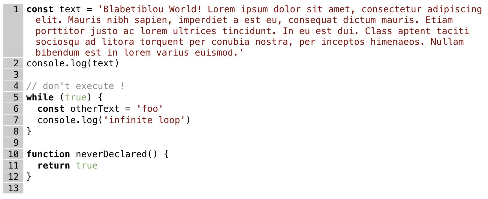

# Syntaxx ReactJS
[](https://www.npmjs.com/package/syntaxx-reactjs) [](https://standardjs.com)

> Highlight code syntax like pro using a truly light wrapper
> around the amazing [Lowlight](https://github.com/wooorm/lowlight)



- [x] **code highlight using [Highlight.js](https://highlightjs.org/)**, including 196 languages and 242 styles
- [x] **line numbering and wrapping** fully css-styleable
- [x] **Optimized experience** both for devs and end users

**Contents**
- [Install](#install)
- [Basic usage](#basic-usage)
- [Configuration](#configuration)
  - [Content](#content)
  - [Properties](#properties)
  - [Styling Highlighting](#styling-highlighting)
  - [Custom look and feel](#custom-look-and-feel)
- [Roadmap](#roadmap)
- [License](#license)

---
## Install

```bash
npm install --save syntaxx-reactjs
```

### NextJS Compatibility
This package is using Lowlight that is provided as [ESM only](https://gist.github.com/sindresorhus/a39789f98801d908bbc7ff3ecc99d99c):
Node 12+ is needed to use it, and it must be `import`ed instead of `require`d.
Unfortunately NextJS doesn't support ESM yet.

[See workaround](./example-nextjs/README.md)

## Basic usage

```jsx
import React from 'react'

import Syntaxx from 'syntaxx-reactjs'
import 'highlight.js/styles/default.css'
import 'syntaxx-reactjs/styles/default.css'

export default function Component() {
  code=`
const c = 'Blabetiblou';
console.log(c);`

  return <Syntaxx language='javascript' value={code} />
}
```

---

## Configuration

### Content
`Syntaxx` expects the code to be highlighted to be provided as a text string
via the component content or alternatively via the `value` [property](#properties).
```jsx
<Syntaxx language="bash">{`CODE_TO=beHighlighted`}</Syntaxx>
```

**Best practices:**
* Use [template literals](https://developer.mozilla.org/en-US/docs/Web/JavaScript/Reference/Template_literals)
  to preserve new lines, indentation and ease usage of `'` and `"`
* If the content starts with a new line `\n`, the first character is ignored. Developers can therefore
  easily check the indentation, including for the first line
  ```js
  const content = `
  while(true) {
    console.log('Blabetiblou');
  }`
  ```
  will display the code, skipping the first empty line
  ```js
  while(true) {
    console.log('Blabetiblou');
  }
  ```
* Longer content should be declared in separated files and later imported
  ```jsx
  export const content = `...`

  import {content} from './codes.js'
  ```

### Properties

| Prop name | default value | description
| --- | --- | --- |
| `language`  | (required) | expected programming language to be highlighted. See available values in [Highlight.js doc](https://github.com/highlightjs/highlight.js/blob/main/SUPPORTED_LANGUAGES.md)
| `value` | | code to be highlighted if no inner content is provided. The first new line `\n` char is ignored if present (see [content](#content) section)
| `firstLineNumber` | 1 | Starting value for the line numbering

### Styling highlighting
Highlight.js comes with hundreds of [pre-built styling](https://highlightjs.org/static/demo/). Just
include them to update the rendering of Syntaxx
```js
import 'highlight.js/styles/default.css'
```

### Custom look and feel
Highlighted lines are disposed using a grid layout that can be fully customized
```html
<pre>
  <code>
    <span class="syntaxx-grid">
      <span class="syntaxx-linenumber">1</span>
      <span class="syntaxx-line">...</span>
      <span class="syntaxx-linenumber">2</span>
      <span class="syntaxx-line">...</span>
      <span class="syntaxx-linenumber">3</span>
      <span class="syntaxx-line">...</span>
    </span>
  </code>
</pre>
```
Only few layout properties are hardcoded in `style` attribute and are advised to be kept untouched

| element | reserved css property | value |
| --- | --- | --- |
| `span.syntaxx-grid` | `display` | `grid`
| `span.syntaxx-grid` | `grid-template-columns` | `auto 1fr`
| `span.syntaxx-linenumber` | `grid-column` | 1
| `span.syntaxx-line` | `grid-column` | 2
| `span.syntaxx-line` | `white-space` | `pre-wrap`

Other attributes can be updated with no risk.
```css
code > span.syntaxx-grid {
  font-family: monospace, "Courier New";
}
code > span.syntaxx-grid > span {
  /* Vertical space between lines */
  margin-bottom: 1px;
}
code > span.syntaxx-grid > span.syntaxx-linenumber {
  /* line numbering background */
  background-color: red;
}
code > span.syntaxx-grid > span.syntaxx-line {
  /* Nice line wrapping */
  padding: 1em;
  text-indent: -1em;
}
```
---

## Roadmap
- [x] Publish on NPM
- [x] Start line number
- [ ] Mark line
- [ ] Line comment
- [ ] Inline code
- [ ] de-indent
- [ ] optional empty first line removal + write doc of registerLanguage
- [ ] add property of component to register language
- [ ] optionally load languages
- [ ] dynamic styling
- [x] render optimization
- [ ] responsive layout
- [ ] optional line numbering select protection
- [ ] demo website
- [ ] secondary stylesheet

## License

MIT © [https://github.com/raphaeljoie](https://github.com/https://github.com/raphaeljoie)
